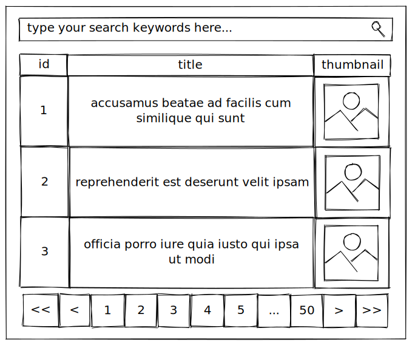
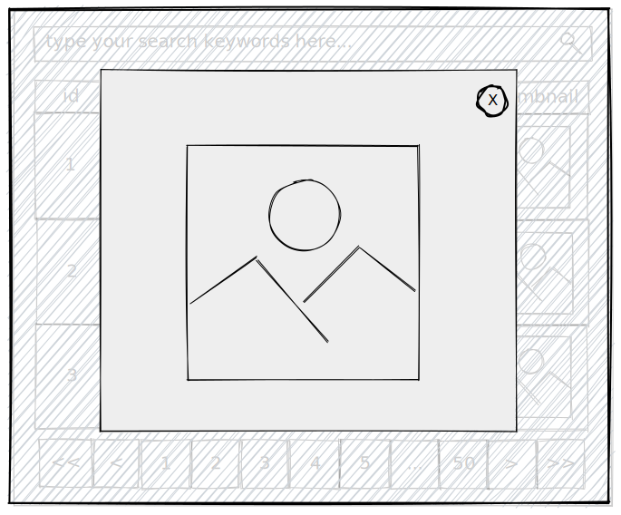
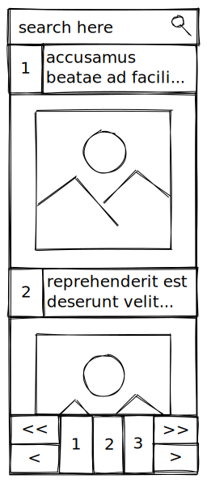

# senior-fullstack-nextjs-search

## DESCRIPTION:
Build a search application that:

- searches on a collection of photo data
- displays the results in a table format
- you can either use Graphql or Rest API from one of the following placeholder data sources:
  - GraphQL option: https://graphqlzero.almansi.me/
  - Rest API option: http://jsonplaceholder.typicode.com/

## OUTCOME:
You should build something like this:

## DESIGNS:

### PAGE DESIGN DESKTOP

### PAGE DESIGN DESKTOP WITH MODAL OPEN

### PAGE DESIGN MOBILE

## TECHNICAL REQUIREMENTS:

This is a simple application but your code and structure will be assessed. So please give it meaningful importance.
UI doesn’t have to be very fancy but make it friendly to a user is a must.

**You must use:**
- React
- Typescript
- Unit Testing

**You can use:**
- Any library that makes sense

**Bonus:**
- Deploy and host your project to AWS or other cloud services is a bonus.
- Mobile friendly is a BIG bonus.
- Performant code will be looked very positively.

If this sounds too simple for you, add some additional features to this plain and boring App

Good luck and have fun!
